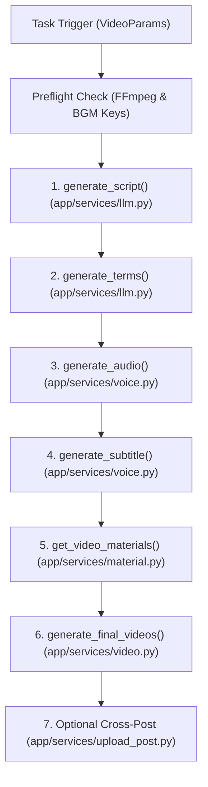
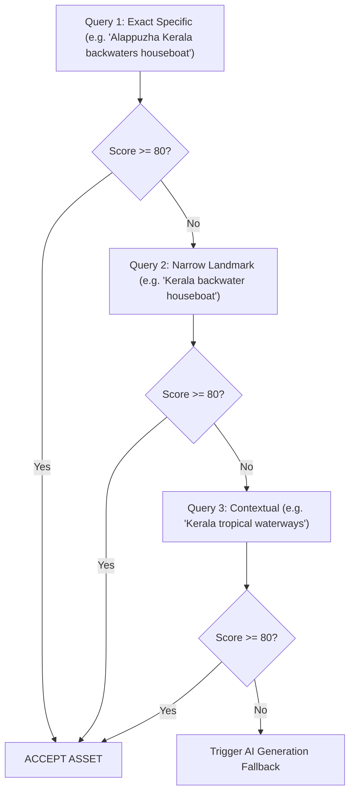
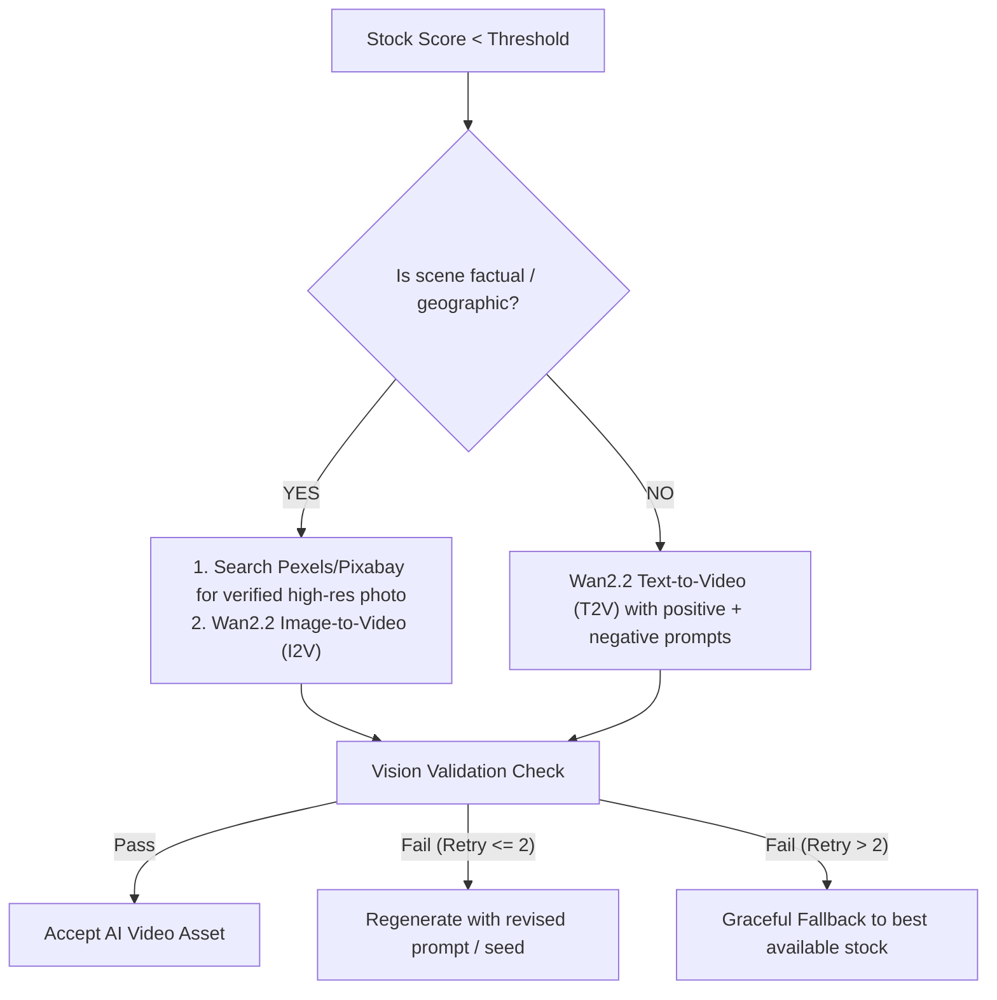

# Semantic Visual Engine — Implementation Source of Truth

> **Status**: Specification & Architecture Source of Truth  
> **Module Target**: `app/services/visual_engine/`  
> **Feature Flag**: `config.app["visual_engine"]["enabled"]` (Default: `false`)

---

## 1. Current MoneyPrinterTurbo Video Pipeline

The current MoneyPrinterTurbo architecture is coordinated by [app/services/task.py](file:///Users/sunny/MoneyPrinterTurbo/app/services/task.py) inside `_run_pipeline()` (lines 1213–1460). Tasks are initiated via CLI ([cli.py:run_cli](file:///Users/sunny/MoneyPrinterTurbo/cli.py#L721)), WebUI ([webui/Main.py](file:///Users/sunny/MoneyPrinterTurbo/webui/Main.py)), or REST API ([app/controllers/v1/video.py](file:///Users/sunny/MoneyPrinterTurbo/app/controllers/v1/video.py)).



### Key Execution Stages:
1. **Script Generation** ([app/services/task.py:287](file:///Users/sunny/MoneyPrinterTurbo/app/services/task.py#L287)): Calls `llm.generate_script()`. If `params.video_script` is empty, an LLM prompt synthesizes raw text paragraphs.
2. **Search Term Generation** ([app/services/task.py:308](file:///Users/sunny/MoneyPrinterTurbo/app/services/task.py#L308)): Calls `llm.generate_terms()` to produce 5–8 global search keywords (e.g. `['AI tools', 'technology']`).
3. **Audio Synthesis & Timing** ([app/services/task.py:495](file:///Users/sunny/MoneyPrinterTurbo/app/services/task.py#L495)): Calls `voice.tts()`, producing `storage/tasks/<task_id>/audio.mp3`. The exact duration `audio_duration` is measured via `voice.get_audio_duration()`.
4. **Subtitle Extraction** ([app/services/task.py:556](file:///Users/sunny/MoneyPrinterTurbo/app/services/task.py#L556)): Builds `subtitle.srt` using timestamp cues from Edge TTS or Whisper.
5. **Stock Material Fetching** ([app/services/task.py:696](file:///Users/sunny/MoneyPrinterTurbo/app/services/task.py#L696)): Calls `material.download_videos()`, which searches Pexels/Pixabay across the global search terms until total downloaded video length meets `audio_duration`.
6. **Video Combination** ([app/services/video.py:538](file:///Users/sunny/MoneyPrinterTurbo/app/services/video.py#L538)): `video.combine_videos()` slices downloaded clips into 3–5s segments, normalizes resolution/aspect ratio, and concatenates them with FFmpeg into `combined-1.mp4`.
7. **Final Multiplexing** ([app/services/video.py:991](file:///Users/sunny/MoneyPrinterTurbo/app/services/video.py#L991)): `video.generate_video()` layers `combined-1.mp4`, `audio.mp3`, rendered subtitle text clips, and optional BGM into `final-1.mp4`.

---

## 2. Existing Pexels / Pixabay Flow & Limitations

Stock material handling is centralized in [app/services/material.py](file:///Users/sunny/MoneyPrinterTurbo/app/services/material.py):

* **Pexels Search** ([app/services/material.py:295](file:///Users/sunny/MoneyPrinterTurbo/app/services/material.py#L295)): `search_videos_pexels(search_term, minimum_duration, video_aspect)`.
* **Pixabay Search** ([app/services/material.py:377](file:///Users/sunny/MoneyPrinterTurbo/app/services/material.py#L377)): `search_videos_pixabay(search_term, minimum_duration, video_aspect)`.
* **Download & Cache** ([app/services/material.py:1140](file:///Users/sunny/MoneyPrinterTurbo/app/services/material.py#L1140)): `download_videos()` caches raw files in `storage/cache_videos/vid-<hash>.mp4` and indexes metadata via [app/services/material_cache.py](file:///Users/sunny/MoneyPrinterTurbo/app/services/material_cache.py).

### Core Limitations in Existing System:
* **Global Keyword Dilution**: Keywords are generated for the entire video at once rather than scene-by-scene.
* **No Semantic Negative Filtering**: A search for "Goa beach" or "Kerala backwaters" returns generic or unrelated Indian stock clips (e.g. North Indian temples, Ganges river) because stock APIs rely on loose keyword tags.
* **No Relevance Scoring**: Any clip returned by the stock API is accepted as long as its aspect ratio and minimum duration match.
* **Unconstrained Concatenation**: Visual clips are shuffled or sequentially placed without anchoring to the exact sentence being spoken at that timestamp.

---

## 3. New Scene-Planning Architecture

The Semantic Visual Engine replaces coarse keyword-based downloading with structured **Scene Planning**:

```
Narration Script + Total Audio Duration
                   │
                   ▼
┌────────────────────────────────────────────────────────┐
│                      Scene Planner                     │
│  (LLM Prompting with strict JSON output schema)        │
└──────────────────────────┬─────────────────────────────┘
                           │
                           ▼
          List of Semantic Scene Plans [Scene 1, Scene 2, ...]
          (Each with timestamps, queries, positive/negative prompts)
```

1. **Narration Chunking**: The narration is split into 4–8 distinct visual scenes (each 4–10 seconds long).
2. **Audio Time Synchronization**: Using exact speech timestamps (or proportional word weighting mapped to `audio_duration`), each scene receives exact `start_time`, `end_time`, and `duration_seconds`.
3. **Structured Visual Intent**: For every scene, the LLM determines:
   * Is this scene **factual/geographic** (e.g. Taj Mahal, Kerala houseboats) or **conceptual/abstract** (e.g. AI algorithms, business productivity)?
   * Positive semantic search queries (ordered from specific to broad).
   * Detailed AI generation prompts.
   * Explicit negative prompts to reject geographical or contextual hallucinations.

---

## 4. Scene Schema (JSON & Pydantic Specifications)

The engine models all visual requirements as validated Pydantic schemas in `app/services/visual_engine/schema.py`:

```python
from pydantic import BaseModel, Field
from typing import List, Optional

class VisualIntent(BaseModel):
    subject: str = Field(description="Primary subject of the scene")
    location: Optional[str] = Field(default="", description="Specific location or landmark if applicable")
    objects: List[str] = Field(default_factory=list, description="Key visible items/props")
    action: str = Field(description="Movement or action occurring in the scene")
    style: str = Field(default="realistic documentary footage", description="Cinematic style")
    stock_queries: List[str] = Field(description="Specific-to-broad search queries for Pexels/Pixabay")
    ai_prompt: str = Field(description="High-detail positive prompt for AI video/image generator")
    negative_prompt: List[str] = Field(default_factory=list, description="Forbidden elements to avoid hallucinations")
    visual_priority: str = Field(default="high", description="high | medium | low")
    factual_visual: bool = Field(description="True if location/subject must be visually authentic")

class ScenePlan(BaseModel):
    scene_id: str = Field(description="Unique scene identifier, e.g. scene_001")
    scene_index: int = Field(description="1-indexed sequence number")
    narration: str = Field(description="Narration sentence spoken during this scene")
    start_time: float = Field(description="Start time in seconds")
    end_time: float = Field(description="End time in seconds")
    duration_seconds: float = Field(description="Target clip duration in seconds")
    visual_intent: VisualIntent

class SceneAsset(BaseModel):
    scene_id: str
    file_path: str
    source_type: str  # 'stock' | 'ai_i2v' | 'ai_t2v' | 'cached' | 'fallback'
    quality_score: float
    duration: float
    seed: Optional[int] = None
    prompt_used: Optional[str] = None
```

---

## 5. Visual Relevance Scoring

Every candidate clip retrieved from stock providers is scored across 6 dimensions:

$$\text{Relevance Score} = S_{\text{location}} + S_{\text{subject}} + S_{\text{object}} + S_{\text{action}} + S_{\text{semantic}} + S_{\text{orientation}}$$

| Dimension | Max Points | Evaluation Method |
| :--- | :--- | :--- |
| **Location Match** | 30 | Exact match of city/region in stock title/tags (or 30 if scene is non-geographic) |
| **Subject Match** | 30 | Direct presence of primary subject keywords in asset metadata |
| **Object Match** | 15 | Ratio of detected/tagged secondary objects |
| **Action Match** | 10 | Verb/motion match in title or description |
| **Semantic Similarity** | 10 | Cosine similarity or LLM verification between narration and stock tags |
| **Aspect / Resolution** | 5 | Exact match with requested aspect ratio (9:16, 16:9, 1:1) |
| **Negative Penalty** | -50 | Presence of any term in `negative_prompt` immediately disqualifies the asset |

### Threshold Gate:
* **Factual Scene (`factual_visual = true`)**: Requires $\text{Score} \ge 80$. Below 80, the stock result is rejected.
* **Conceptual Scene (`factual_visual = false`)**: Requires $\text{Score} \ge 65$.
* **Hard Reject**: Any asset with $\text{Score} < 50$ or containing negative prompt terms is discarded.

---

## 6. Stock-First Strategy

To optimize generation speed and API expenditure, stock footage is always queried first using a hierarchical cascade:



---

## 7. AI Fallback Strategy

AI video generation is engaged **only when stock searches fail to meet the relevance score threshold**.



---

## 8. Wan2.2 TI2V-5B Provider Abstraction

AI generation is isolated through a provider interface in `app/services/visual_engine/ai_provider.py`:

```python
from abc import ABC, abstractmethod

class BaseVideoProvider(ABC):
    @abstractmethod
    def generate_text_to_video(
        self, prompt: str, negative_prompt: str, duration: float, aspect: str, seed: int
    ) -> str:
        """Returns local path to generated .mp4 file."""
        pass

    @abstractmethod
    def generate_image_to_video(
        self, image_path: str, prompt: str, negative_prompt: str, duration: float, aspect: str, seed: int
    ) -> str:
        """Returns local path to generated .mp4 file."""
        pass
```

### Concrete Providers:
1. **`HuggingFaceProvider`**: Connects to Hugging Face Inference Providers routing for `Wan-AI/Wan2.2-TI2V-5B` using `HF_TOKEN`. Formats parameters: `prompt`, `negative_prompt`, `guidance_scale=6.0`, `num_frames=81`, `seed`.
2. **`MockProvider`**: Generates synthetic color-block/test MP4 clips with text overlays in local development/CI mode (`VISUAL_ENGINE_MODE=mock`), consuming zero API credits.
3. **`LocalWanProvider`** *(Future extension)*: Direct integration for local GPU workstations.

---

## 9. Image-to-Video (I2V) Strategy for Factual Visuals

When generating factual landmarks (e.g. *Taj Mahal, Gateway of India, Alappuzha Houseboats, Eiffel Tower*), Text-to-Video models can hallucinate architecture.

### I2V Workflow:
1. **Anchor Image Retrieval**: The engine queries Pexels/Pixabay Photo APIs for an authentic high-resolution still image matching the exact location.
2. **Motion Synthesis**: The still image is passed into Wan2.2 I2V alongside a camera motion prompt (e.g., *"slow cinematic aerial panning across Alappuzha backwaters, documentary lighting, 4k"*).
3. **Result**: Authentic real-world architecture with fluid cinematic motion.

---

## 10. Text-to-Video (T2V) Strategy for Conceptual Visuals

For abstract, non-geographic concepts (*"data packets flowing through neural network synapses"*, *"businessman celebrating breakthrough in modern office"*):
* Direct Wan2.2 T2V generation.
* Uses dynamic positive prompts structured by the Scene Planner.
* Negative prompt prevents low-frame-rate artifacts, blur, morphing, and text rendering.

---

## 11. Asset Caching & Task Resumability

To protect against GitHub Actions runner cancellations and save credits, assets are cached deterministically:

### Cache Structure:
```
storage/semantic_cache/
├── <scene_hash>/
│   ├── metadata.json
│   ├── source_image.jpg (if I2V)
│   └── clip.mp4
```

### `metadata.json` Schema:
```json
{
  "scene_hash": "a8f93b1...",
  "prompt": "Cinematic aerial view of Alappuzha backwaters...",
  "provider": "huggingface",
  "model": "Wan-AI/Wan2.2-TI2V-5B",
  "seed": 84729103,
  "duration": 6.5,
  "created_at": "2026-08-23T18:00:00Z",
  "source": "ai_i2v"
}
```

* If a CI run fails at Scene 4 of 6, the subsequent run detects cached assets for Scenes 1–3 and resumes instantly at Scene 4.

---

## 12. Retry & Degradation Hierarchy

1. **Attempt 1**: High-priority stock search or AI generation.
2. **Attempt 2**: AI generation with jittered seed ($seed + 1$) and expanded negative prompt.
3. **Fallback Level 1**: Secondary stock search with relaxed threshold ($\text{Score} \ge 55$).
4. **Fallback Level 2**: Generic theme-level background clip with warning flag.
5. **Guarantee**: A single scene failure **never** crashes the overall video pipeline.

---

## 13. Configuration Specification

Add to [config.example.toml](file:///Users/sunny/MoneyPrinterTurbo/config.example.toml) and [config.toml](file:///Users/sunny/MoneyPrinterTurbo/config.toml):

```toml
# -----------------------------------------------------------------------------
# Semantic Visual Engine / 语义视觉生成引擎
# -----------------------------------------------------------------------------
[visual_engine]
# Enable semantic scene-by-scene visual planning and AI generation
enabled = false

# Execution mode: "hybrid" (stock first, AI fallback), "stock_only", "ai_only", "mock"
mode = "hybrid"

# AI Provider: "huggingface" | "mock"
provider = "huggingface"
model = "Wan-AI/Wan2.2-TI2V-5B"

# Minimum relevance score thresholds (0-100)
stock_min_score = 65
factual_min_score = 80

# Prefer stock image -> Wan I2V for factual landmarks
prefer_i2v_for_factual = true

# Maximum AI scene generations per video (budget safety limit)
max_ai_scenes_per_video = 6

# Maximum AI retries per scene before falling back to stock
max_ai_attempts = 2

# Enable local file & CI cache
cache_enabled = true
```

---

## 14. Environment Variables

| Variable | Description | Where Configured |
| :--- | :--- | :--- |
| `HF_TOKEN` | Hugging Face user access token for Wan2.2 inference | GitHub Secrets & Local `.env` |
| `VISUAL_ENGINE_ENABLED` | Overrides `visual_engine.enabled` | GitHub Actions env / Docker env |
| `VISUAL_ENGINE_MODE` | Set to `mock` in testing/CI; `hybrid` in production | GitHub Actions workflow / `.env` |
| `PEXELS_API_KEY` | Pexels REST API access key | GitHub Secrets / `config.toml` |
| `PIXABAY_API_KEY` | Pixabay REST API access key | GitHub Secrets / `config.toml` |
| `GEMINI_API_KEY` | LLM key for Scene Planner analysis | GitHub Secrets / `config.toml` |

---

## 15. GitHub Actions Integration

In `.github/workflows/generate_video.yml`:
1. **Safety Budget Cap**: `max_ai_scenes_per_video = 5` ensures CI job timeout (< 45 min) is never exceeded.
2. **Environment Passthrough**: Passes `HF_TOKEN` from GitHub repository secrets to [scripts/apply_secrets.py](file:///Users/sunny/MoneyPrinterTurbo/scripts/apply_secrets.py).
3. **Artifact Archival**: Retains `storage/semantic_cache/**` in GitHub Actions artifact zip for inspection.

---

## 16. Verification & Testing Strategy

### Benchmark Test Matrix:
* **Test Case A (Geographic Factual)**:
  * *Prompt*: `"Kerala is famous for its extensive backwaters and traditional houseboats..."`
  * *Success Criteria*: Visual contains houseboats and tropical palm waterways. Negative filter rejects Ganges, Varanasi, snow, and North Indian temples.
* **Test Case B (Coastal Factual)**:
  * *Prompt*: `"Goa's sunny coastline attracts millions of beach lovers..."`
  * *Success Criteria*: Visual contains Arabian Sea beaches, palm coastline. Negative filter rejects inland temples and mountains.
* **Test Case C (Landmark I2V)**:
  * *Prompt*: `"The Taj Mahal in Agra is a masterpiece of white marble..."`
  * *Success Criteria*: Anchor photo of Taj Mahal converted into cinematic I2V.
* **Test Case D (Conceptual Tech)**:
  * *Prompt*: `"Modern artificial intelligence algorithms process billions of data points..."`
  * *Success Criteria*: Stock footage (Score $\ge 65$) or Wan2.2 T2V abstract digital graphics.

---

## 17. Codebase Modifications Matrix

### New Modules to Create:
1. `app/services/visual_engine/__init__.py`: Package initialization.
2. `app/services/visual_engine/schema.py`: Pydantic definitions for `VisualIntent`, `ScenePlan`, `SceneAsset`, `RelevanceScore`.
3. `app/services/visual_engine/scene_planner.py`: Analyzes narration and audio timestamps to produce fine-grained visual scene requirements.
4. `app/services/visual_engine/search_scorer.py`: Evaluates Pexels/Pixabay candidate clips against positive/negative visual intents.
5. `app/services/visual_engine/ai_provider.py`: Provider abstraction (`HuggingFaceProvider`, `MockProvider`, Wan2.2 TI2V-5B).
6. `app/services/visual_engine/engine.py`: Orchestrator implementing the Decision Tree (Stock Search → Score → Threshold Check → AI Generation → Validation → Fallback).
7. `test/services/test_visual_engine.py`: Comprehensive test suite with mocked LLM and Hugging Face calls.

### Existing Modules to Modify (Minimal & Non-Breaking):
1. [config.example.toml](file:///Users/sunny/MoneyPrinterTurbo/config.example.toml) & [config.toml](file:///Users/sunny/MoneyPrinterTurbo/config.toml): Add `[visual_engine]` section (default `enabled = false`).
2. [app/models/schema.py](file:///Users/sunny/MoneyPrinterTurbo/app/models/schema.py): Add optional `visual_engine_enabled` to `VideoParams`.
3. [app/services/task.py](file:///Users/sunny/MoneyPrinterTurbo/app/services/task.py): In `get_video_materials()`, if `config.app.get("visual_engine", {}).get("enabled")`, route through `visual_engine.engine.acquire_scene_materials()`.
4. [scripts/apply_secrets.py](file:///Users/sunny/MoneyPrinterTurbo/scripts/apply_secrets.py): Add mapping for `HF_TOKEN` and `VISUAL_ENGINE_*`.

---

## 18. Components That Must Remain Untouched

1. **Audio Synthesis & TTS**: [app/services/voice.py](file:///Users/sunny/MoneyPrinterTurbo/app/services/voice.py) (`tts`, `azure_tts_v1`, `edge_tts_v1`, `openai_tts`, `gemini_tts`).
2. **Subtitle Extraction & Whisper**: [app/services/subtitle.py](file:///Users/sunny/MoneyPrinterTurbo/app/services/subtitle.py) and `voice.create_subtitle()`.
3. **Video Rendering & Subtitle Burning**: [app/services/video.py:generate_video()](file:///Users/sunny/MoneyPrinterTurbo/app/services/video.py#L991), `wrap_text()`, and TextClip rendering.
4. **Task State Machine & Public REST API**: [app/controllers/v1/video.py](file:///Users/sunny/MoneyPrinterTurbo/app/controllers/v1/video.py) and [app/services/state.py](file:///Users/sunny/MoneyPrinterTurbo/app/services/state.py).
5. **Legacy Stock Flow**: Legacy execution path remains 100% active when `visual_engine.enabled = false`.
